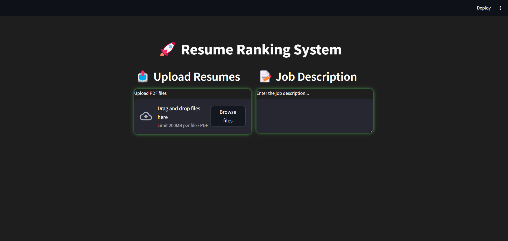
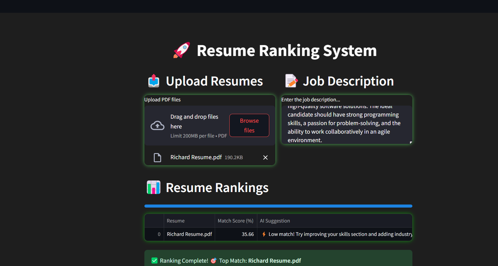
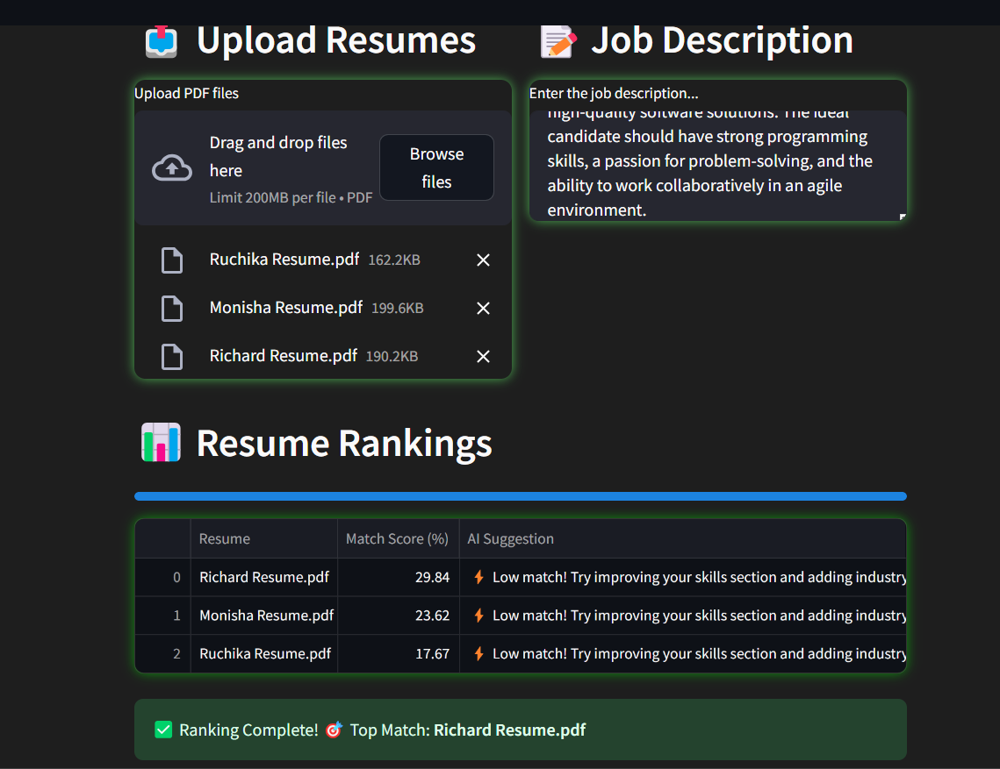

# AI-powered-Resume-Screening-and-Ranking-System

### An AI-powered system for automated resume screening and ranking based on job descriptions.

## 📌 Overview
The **Resume Ranking System** is an AI-driven tool designed to simplify and optimize the hiring process. It allows recruiters to upload resumes, enter a job description, and receive ranked resumes based on their relevance. This system leverages **Natural Language Processing (NLP)** and **Machine Learning (ML)** algorithms to evaluate and compare resumes efficiently.

## ✨ Features
- 📂 **Upload multiple resumes** (PDF format, max 200MB per file)
- 📝 **Input job description** to match candidate profiles
- 📊 **Resume ranking system** using NLP and ML techniques
- 🔍 **Match score (%)** to evaluate candidate relevance
- 💡 **AI suggestions** for resume improvement
- 🎨 **Dark theme UI** with a sleek, interactive design
- ☁ **Deployed using Streamlit**

## 🛠️ Tech Stack
- **Frontend & UI:** Streamlit
- **Backend:** Python, Flask
- **NLP Processing:** spaCy, NLTK, TF-IDF
- **Machine Learning:** Scikit-learn, KNN, Cosine Similarity
- **Data Handling:** Pandas, NumPy
- **Deployment:** Streamlit Cloud / Local Hosting

## 📷 Screenshots
### Upload Resumes & Enter Job Description



### Resume Ranking Results


## 🏗️ Installation & Setup
### Clone the Repository
```bash
git clone https://github.com/rutikakengal/AI-Resume-Screening-And-System-Ranking.git
cd AI-Resume-Screening-And-System-Ranking
```

### Install Dependencies
```bash
pip install -r requirements.txt
```

### Run the Application
```bash
streamlit run app.py
```

## 🎯 How It Works
1. **Upload resumes** (PDF format)
2. **Enter job description** in the input box
3. Click **Submit** to process and rank resumes
4. **View ranked resumes** with match scores & AI suggestions

## 📌 Future Enhancements
- ✅ Support for DOCX and other file formats
- ✅ Advanced AI-based skill extraction
- ✅ Cloud-based deployment

## 💡 Contributing
Contributions are welcome! Feel free to fork this repo and submit a pull request.

## 🔗 Connect With Me
- **GitHub:** [rutikakengal](https://github.com/rutikakengal)
- **LinkedIn:** [rutikakengal](www.linkedin.com/in/rutika-kengal-b3b0a22b7)

---
🚀 **Transform your hiring process with AI-powered resume ranking!**
